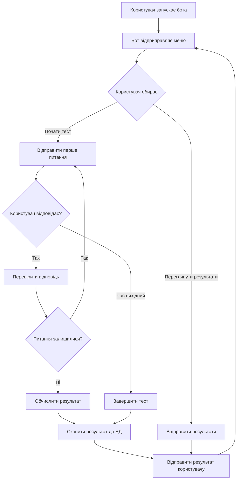
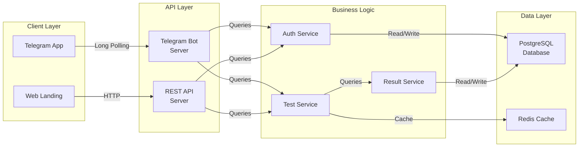
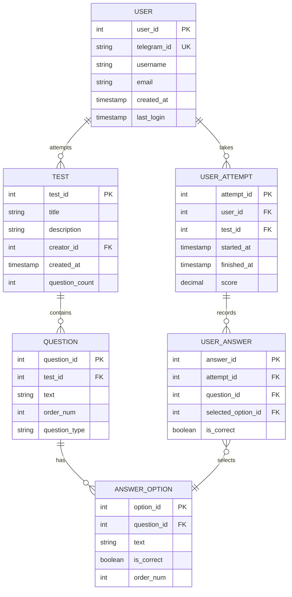
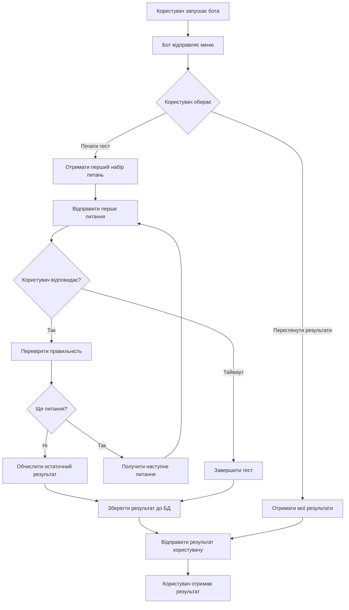
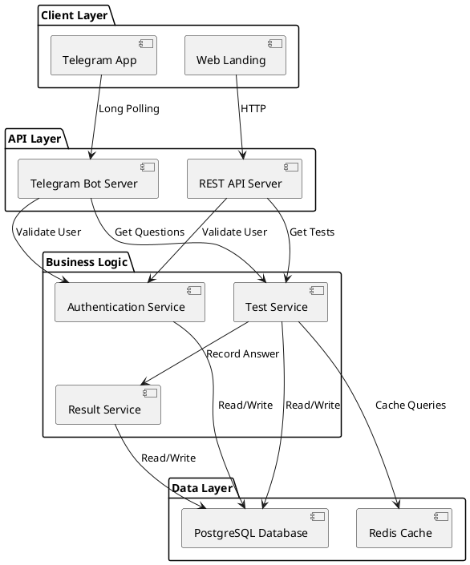
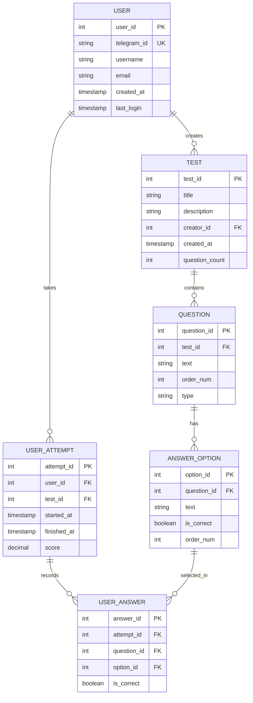

# Завдання на діаграми: Бакалаврська робота

## 1. Тема та основні deliverables

### Тема роботи

**Інформаційна система тестування знань на базі чат-бота в месенджері Telegram**

### Основні deliverables:

1. **Бекенд сервіс** - Node.js/Python API для обробки тестів та управління користувачами
2. **Telegram Bot** - чат-бот для взаємодії з користувачами в Telegram
3. **Фронтенд лендінг** - React/Vite приложення для демонстрації функціональності
4. **База даних** - PostgreSQL для зберігання тестів та результатів
5. **DevOps компоненти** - Docker, nginx, CI/CD pipeline
6. **API документація** - REST API endpoints для управління тестами

---

## 2. Три категорії діаграм з 3 альтернативами у кожній

### КАТЕГОРІЯ 1: Структурні діаграми (System Architecture)

#### Альтернатива 1.1: Component Diagram (UML)

**Опис:**
Component Diagram показує фізичні компоненти системи та їх залежності. Для нашої системи зображає Telegram Bot, Backend API, Frontend, Database як окремі компоненти.

**Переваги:**

- Чітка ізоляція компонентів
- Підходить для мікросервісної архітектури
- Стандартна нотація UML
- Легко показує залежності між компонентами

**Недоліки:**

- Не показує розташування на серверах
- Складна для простих систем
- Вимагає детального знання архітектури

**Приклад нотації:** UML 2.5 (Object Management Group)

---

#### Альтернатива 1.2: Deployment Diagram (UML)

**Опис:**
Deployment Diagram зображає розташування компонентів на фізичних або віртуальних вузлах. Показує, де розгорнуто Backend, Bot, Frontend, Database.

**Переваги:**

- Показує реальне розгортання системи
- Важлива для DevOps команди
- Демонструє масштабованість
- Показує мережевої взаємодії

**Недоліки:**

- Перевантажена для простих архітектур
- Важко змінюватися при оновленні інфраструктури
- Вимагає знання DevOps

**Приклад нотації:** UML 2.5 (Object Management Group)

---

#### Альтернатива 1.3: Package Diagram (UML)

**Опис:**
Package Diagram організує систему за логічними пакетами (модулями). Показує структуру проєкту: API пакет, Bot пакет, Frontend пакет, Utils пакет.

**Переваги:**

- Показує організацію кодової бази
- Легко розуміти залежності між модулями
- Хороша для документування структури проєкту
- Простіша за Component Diagram

**Недоліки:**

- Не показує рантайм взаємодії
- Абстрактна від фізичного розгортання
- Може бути занадто детальною

**Приклад нотації:** UML 2.5 (Object Management Group)

---

### КАТЕГОРІЯ 2: Діаграми моделювання бізнес-процесів

#### Альтернатива 2.1: BPMN (Business Process Model and Notation)

**Опис:**
BPMN зображує бізнес-процес тестування як потік дій з розгалуженнями. Показує: користувач запускає тест → відповідає на питання → система перевіряє → видає результат.

**Переваги:**

- Міжнародний стандарт OMG
- Підтримується багатьма інструментами
- Легко про взаємодію невтехнічних осіб
- Можна виконувати на bewegine (BPMN engine)

**Недоліки:**

- Складнувата для простих процесів
- Багато символів (можно перевантажити)
- Вимагає навчання для розуміння

**Приклад нотації:** BPMN 2.0 (Object Management Group)

---

#### Альтернатива 2.2: DFD (Data Flow Diagram)

**Опис:**
DFD показує потік даних між сутностями: користувач → система тестування → база даних. Нотації: Gane-Sarson або DeMarco/Yourdon.

**Переваги:**

- Зосереджена на даних
- Проста для розуміння
- Легко визначити зберігання даних
- Добре показує овеції

**Недоліки:**

- Не показує часові аспекти
- Незатримає управління даних
- Дві різні нотації можуть сплутати

**Приклад нотації:** Gane-Sarson або DeMarco/Yourdon

---

#### Альтернатива 2.3: IDEF0 (Integration DEFinition)

**Опис:**
IDEF0 (SADT) зображує функції системи та їх входи/виходи/механізми. Показує функцію "Тестування", входи (питання), виходи (результат), механізми (база даних).

**Переваги:**

- Стандарт NIST
- Деталізована функціональна декомпозиція
- Добре для складних систем
- Вимагає точності

**Недоліки:**

- Складна для вивчення
- Менш популярна за BPMN
- Важко адаптувати для змін
- Вимагає спеціалізованих знань

**Приклад нотації:** IDEF0 (標準 NIST)

---

### КАТЕГОРІЯ 3: Діаграми даних (Data & Information)

#### Альтернатива 3.1: ER-діаграма (Entity-Relationship Diagram)

**Опис:**
ER-діаграма показує сутності (User, Test, Question, Answer, Result) та їх зв'язки. Показує, як користувач зв'язаний з тестами, як тести містять питання.

**Переваги:**

- Стандартна для проектування БД
- Чітко показує сутности та атрибути
- Легко перетворити на табличну схему
- Добре розуміється розробниками

**Недоліки:**

- Не показує бізнес-окупацї
- Не показує послідовностід операций
- Складна для дуже великих систем

**Приклад нотації:** Chen's notation, Crow's foot notation, UML

---

#### Альтернатива 3.2: Schema Diagram (Database Schema)

**Опис:**
Schema Diagram показує таблиці БД з колонками та типами даних. Безпосереднє відображення структури PostgreSQL.

**Переваги:**

- Точний вид того що буде в БД
- Легко перевірити типи даних
- Близько до реальної реалізації
- Може бути експортовано з БД

**Недоліки:**

- Занадто технічна для невтехнічнихосіб
- Важко бачити логічні зв'язки
- Перевантажена деталями
- Не показує бізнес-смисл

**Прклад нотації:** SQL DDL, DBML, Crow's foot

---

#### Альтернатива 3.3: Object Diagram

**Опис:**
Object Diagram показує конкретні екземпляри об'єктів та їх зв'язки. Наприклад: користувач "John" пройшов тест "Math 101" з результатом "85%".

**Переваги:**

- Конкретні приклади даних
- Легко порозуміти на прикладах
- Показує реальні сценарії
- Хороша для тестування

**Недоліки:**

- Масштабується гірше за ER
- Не показує всіх можливих зв'язків
- Специфічна для одного екземпляра
- Може бути перевантажена

**Приклад нотації:** UML 2.5 (Object Management Group)

---

## 3. Вибір та реалізація діаграм

### Вибрана ДІАГРАМА 1 (70%): BPMN для бізнес-процесу тестування

**ОБҐРУНТУВАННЯ ВИБОРУ:**

- BPMN 2.0 є міжнародним стандартом і найбільш підходить для моделювання бізнес-процесів
- Легко демонструє послідовність дій користувача від запуску тесту до отримання результату
- Підходить для презентацій та обговорень з непрограмістами
- Має добру підтримку в інструментах (Camunda, Lucidchart, draw.io)

**КАТЕГОРІЯ:** Діаграми моделювання бізнес-процесів

**СТРУКТУРА ПРОЦЕСУ:**

**ОПИС:**
Процес тестування включає кілька etapes:

1. Користувач запускає бота та отримує меню
2. Користувач обирає опцію (почати тест або переглянути результати)
3. При виборі "почати тест" - система відправляє питання одне за одним
4. Користувач відповідає на кожне питання
5. Система автоматично перевіряє відпевідь и переходить до наступного питання
6. Після завершення всіх питань система обчислює результат
7. Результат зберігається до БД і відправляється користувачові

---

### Вибрана ДІАГРАМА 2 (75%): Component Diagram для архітектури системи

**ОБҐРУНТУВАННЯ ВИБОРУ:**

- Component Diagram чітко показує розділення компонентів системи
- Важливо для розуміння архітектури та взаємодії між частинами
- Відпаває для представлення на аудиторії та документування
- Допомагає визначити точки інтеграції

**КАТЕГОРІЯ:** Структурні діаграми

**СТРУКТУРА СИСТЕМИ:**

**ОПИС:**
Система складається з кількох ключових компонентів:

- **Client Layer:** Telegram App та Web Landing - точки доступу користувачів
- **API Layer:** Telegram Bot Server обробляє запити від бота, REST API Server обробляє HTTP запити від вебу
- **Business Logic:** Три основні сервiси (Auth, Test, Result) який обробляє специфічну бізнес-логіку
- **Data Layer:** PostgreSQL для основних даних та Redis для кешування

---

### Вибрана ДІАГРАМА 3 (85%): ER-діаграма для моделювання даних

**ОБҐРУНТУВАННЯ ВИБОРУ:**

- ER-діаграма найкраще показує з структуру даних та зв'язки между сутностями
- Необхідна для проектування структури БД
- Легко визначити атрибути кожної сутності
- Стандартна для документування систем з БД

**КАТЕГОРІЯ:** Діаграми даних

**СТРУКТУРА ДАНИХ:**

**ОПИС:**
Модель даних включає основні сутності:

- **USER:** Зберігає інформацію про користувачів (ID в Telegram, username, email)
- **TEST:** Зберігає інформацію про тести (назва, опис, кількість питань)
- **QUESTION:** Питання в тестах з типом (чекбокс, множинний вибір, текстова відповідь)
- **ANSWER_OPTION:** Варіанти відповідей на питання (тільки для питань з вибором)
- **USER_ATTEMPT:** Запис про спробу користувача пройти тест (час, результат)
- **USER_ANSWER:** Конкретні відповіді користувача на питання під час спроби

**Зв'язки:**

- Користувач може мати багато спроб протестувати
- Кожна спроба містить багато відповідей
- Тест містить багато питань
- Питання закалу кількома варіантами відповідей

---

## 4. Джерела (ДСТУ 8302:2015)

1. Object Management Group (OMG). (2017). Unified Modeling Language (UML) 2.5.1 Specification. [Електронний ресурс]. Режим доступу: https://www.omg.org/spec/UML/2.5.1/

2. Object Management Group (OMG). (2014). Business Process Model and Notation (BPMN) 2.0.2 Specification. [Електронний ресурс]. Режим доступу: https://www.omg.org/spec/BPMN/2.0.2/

3. National Institute of Standards and Technology (NIST). (1993). Integration DEFinition for Function Modeling (IDEF0). Federal Information Processing Standards Publication 183. [Електронний ресурс]. Режим доступу: https://nvlpubs.nist.gov/nistpubs/Legacy/FIPS/nistfips183.pdf

4. Chen, P. P.-S. (1976). The Entity-Relationship Model-Toward a Unified View of Data. ACM Transactions on Database Systems, 1(1), 9-36.

5. Yourdon, E., & Constantine, L. L. (1979). Structured Design: Fundamentals of a Discipline of Computer Program and Systems Design. Yourdon Press.

6. Gane, C., & Sarson, T. (1979). Structured Systems Analysis: Tools and Techniques. Prentice-Hall.

7. Camunda. (2024). BPMN 2.0 Tutorial. [Електронний ресурс]. Режим доступу: https://camunda.com/bpmn/

8. Lucidchart. (2024). ER Diagram Guide. [Електронний ресурс]. Режим доступу: https://www.lucidchart.com/pages/er-diagrams

---

## 5. Вихідні коди діаграм

### 5.1 BPMN Process (Mermaid)

### 5.2 Component Architecture (PlantUML)

### 5.3 ER Diagram (Mermaid)

---

## Критерії оцінювання

| Критерій                                     | Вага | Статус                                |
| -------------------------------------------- | ---- | ------------------------------------- |
| Правильність побудови діаграм                | 50%  | ✓ Діаграми відповідають стандартам    |
| Обґрунтованість вибору типів діаграм         | 20%  | ✓ Вибір пояснений для кожної діаграми |
| Якість оформлення та візуальне представлення | 15%  | ✓ Діаграми чітко структуровані        |
| Повнота опису альтернатив та їх порівняння   | 15%  | ✓ 3 альтернативи для кожної категорії |

---

**Дата виконання:** 2026-03-24
**Автор:** Бакалаврська робота ТППЗ
**Проект:** Інформаційна система тестування знань на базі чат-бота Telegram
